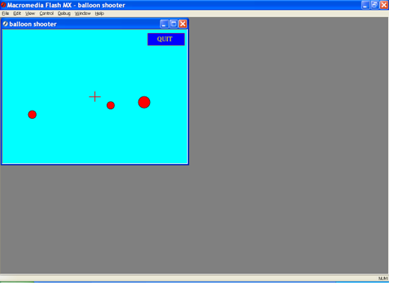
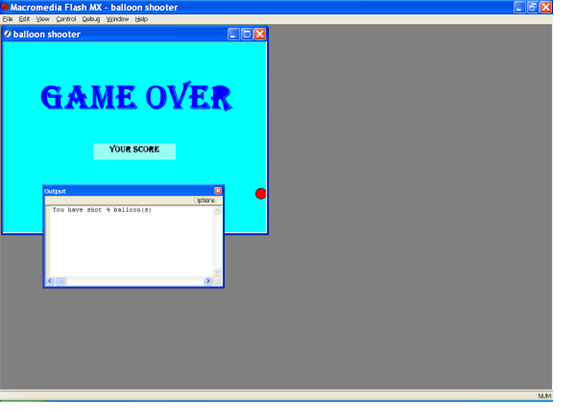

# Balloon_Shooter_Game 

#### My University  2nd year - Computer Graphics - Small Project

## Overview
This document contains an **ActionScript-Game-Coding** (Named: Balloon Shooter). **ActionScript 2.0 (AS2)** is an object-oriented scripting language introduced with Macromedia Flash MX 2004, designed for building interactive, complex web applications and animations. Based on ECMAScript, it introduced strict variable data typing, class-based inheritance, and improved structure, allowing developers to build more reusable and maintainable Flash content.

---

### Balloon Shooter Game Screen in Macromedia Falsh MX

---

### Balloon Shooter Game Over Screen in Macromedia Falsh MX

---

